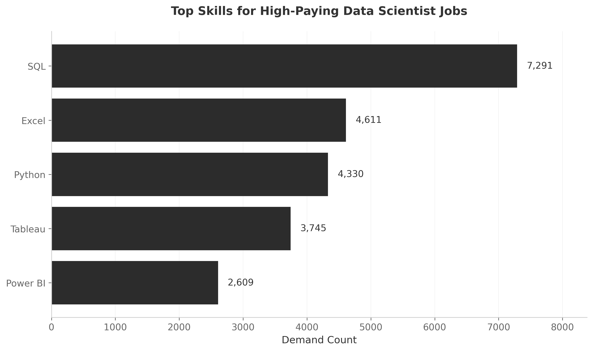

# Overview
Through this project, I analyzed data analyst job postings using SQL to identify top-paying roles, understand which skills are most in-demand, and explore how different skills correlate with salary levels. This analysis has been instrumental in shaping my career strategy and skill development priorities.


🧭 All SQL queries used in this project are available in the [project_sql folder](/Project_SQL)

# Context
I created this project to better understand the current data analyst job market and identify which skills and roles offer the best career opportunities.

### The questions I wanted to answer through my SQL queries were:

1. What are the top-paying data analyst jobs?
2. What skills are required for these top-paying jobs?
3. What skills are most in demand for data analysts?
4. Which skills are associated with higher salaries?
5. What are the most optimal skills to learn?

# Technologies
For my deep dive into the data analyst job market, I harnessed the power of several key tools:

- **SQL:** The backbone of my analysis, allowing me to query the database and unearth critical insights.
- **PostgreSQL:** The chosen database management system, ideal for handling the job posting data.
- **Visual Studio Code:** My go-to for database management and executing SQL queries.
- **Git & GitHub:** Essential for version control and sharing my SQL scripts and analysis, ensuring collaboration and project tracking.

# The Analysis
Each query for this project aimed at investigating specific aspects of the data analyst job market. Here’s how I approached each question:

### 1. Top Paying Data Scientist Jobs
To identify the highest-paying roles, I filtered Data Scientist positions by average yearly salary and location, focusing on remote jobs. This query highlights the high paying opportunities in the field.

```sql
SELECT
    job_id,
    job_title,
    salary_year_avg,
    company_dim.name AS Company_Name,
    job_location,
    job_schedule_type,
    job_posted_date
FROM
    job_postings_fact
LEFT JOIN company_dim ON job_postings_fact.company_id = company_dim.company_id
WHERE
    job_title_short = 'Data Scientist' AND
    job_location = 'Anywhere' AND
    salary_year_avg IS NOT NULL
ORDER BY
    salary_year_avg DESC

LIMIT 10;
```
Here's the breakdown of the top Data Scientist jobs in 2023:

- **Exceptional Salary Ceiling:** The highest-paid Data Scientist positions command $550K annually, with the top 10 roles ranging from $300K-$550K demonstrating that elite data science expertise can reach executive-level compensation.
- **Leadership Premium:** The majority of top-paying roles are senior leadership positions (Head of, Director, Distinguished), indicating that strategic management of data teams and business analytics drives the highest compensation over individual contributor work.
- **Specialized Recruiters Dominate:** Selby Jennings appears twice in the top 3 positions, suggesting that specialized financial/quantitative recruiting firms may offer access to the most lucrative opportunities, particularly in finance and quant research sectors.


*Bar graph visualizing the salary for the top 10 salaries for Data Scientists; The graph below visualizes the salary distribution for the top 10 highest-paying Data Scientist roles.*

### 2. Skills for Top Paying Jobs
To understand what skills are required for the top-paying jobs, I joined the job postings with the skills data, providing insights into what employers value for high-compensation roles.
```sql
WITH Top_Paying_Jobs AS
(
    SELECT
    job_id,
    job_title,
    salary_year_avg,
    company_dim.name AS Company_Name,
    job_location,
    job_schedule_type,
    job_posted_date
FROM
    job_postings_fact
LEFT JOIN company_dim ON job_postings_fact.company_id = company_dim.company_id
WHERE
    job_title_short = 'Data Scientist' AND
    job_location = 'Anywhere' AND
    salary_year_avg IS NOT NULL
ORDER BY
    salary_year_avg DESC
)
SELECT 
    skills_dim.skills AS Required_Skill,
    Top_Paying_Jobs.* 
FROM
    Top_Paying_Jobs
INNER JOIN 
    skills_job_dim ON Top_Paying_Jobs.job_id = skills_job_dim.job_id
INNER JOIN
    skills_dim ON skills_job_dim.skill_id = skills_dim.skill_id
ORDER BY
    salary_year_avg DESC
LIMIT 10;
```
Here's the breakdown of the most demanded skills for the top 10 highest paying Data Scientist jobs in 2023:
- **SQL dominates high-paying data roles** With 8 mentions across top-salary positions (including jobs paying $550K and $525K), SQL is the most in-demand skill for premium data science positions.
- **Python is the close second**  Appearing 7 times in the dataset, Python is nearly as essential as SQL for lucrative data science roles, particularly in quant research and analytics positions.
- **Big data tech commands premium salaries**  The highest-paying role ($375K at Algo Capital) requires a diverse tech stack including Spark, Hadoop, and Cassandra, suggesting big data infrastructure expertise significantly boosts compensation potential.


*Bar graph visualizing the count of skills for the top 10 paying jobs for Data Scientists; Claude generated this graph from my SQL query results*

### 3. In-Demand Skills for Data Analysts

This query helped identify the skills most frequently requested in job postings, directing focus to areas with high demand.

```sql
SELECT 
    skills,
    COUNT(skills_job_dim.job_id) AS demand_count
FROM job_postings_fact
INNER JOIN skills_job_dim ON job_postings_fact.job_id = skills_job_dim.job_id
INNER JOIN skills_dim ON skills_job_dim.skill_id = skills_dim.skill_id
WHERE
    job_title_short = 'Data Analyst' 
    AND job_work_from_home = True 
GROUP BY
    skills
ORDER BY
    demand_count DESC
LIMIT 5;
```
Here's the breakdown of the most demanded skills for data analysts in 2023
- **SQL** and **Excel** remain fundamental, emphasizing the need for strong foundational skills in data processing and spreadsheet manipulation.
- **Programming** and **Visualization Tools** like **Python**, **Tableau**, and **Power BI** are essential, pointing towards the increasing importance of technical skills in data storytelling and decision support.

| Skills   | Demand Count |
|----------|--------------|
| SQL      | 7291         |
| Excel    | 4611         |
| Python   | 4330         |
| Tableau  | 3745         |
| Power BI | 2609         |

*Table of the demand for the top 5 skills in data analyst job postings*

### 4. Skills Based on Salary
Exploring the average salaries associated with different skills revealed which skills are the highest paying.
```sql
SELECT 
    skills AS demanded_skill,
    ROUND (AVG(salary_year_avg),0) AS Annual_Salary
FROM job_postings_fact
INNER JOIN 
    skills_job_dim ON job_postings_fact.job_id = skills_job_dim.job_id
INNER JOIN
    skills_dim ON skills_job_dim.skill_id = skills_dim.skill_id
WHERE
    job_title_short = 'Data Engineer'
    AND salary_year_avg IS NOT NULL
    AND job_work_from_home = TRUE
GROUP BY
    demanded_skill
ORDER BY
    Annual_Salary DESC
LIMIT 25
```

**Specialized & Niche Technologies Command Premium Salaries:** Assembly language ($192.5K), blockchain development tools (Solidity at $166.3K), and functional programming languages (Clojure at $170.9K, Julia at $160.5K) top the salary charts, indicating that rare, specialized technical skills in emerging or legacy systems command significant premiums over mainstream tools.

**Database & Infrastructure Expertise Drives High Compensation:** Proficiency in modern database technologies (MongoDB at $182.2K, Neo4j at $166.6K, Redis at $157K, Cassandra at $151.3K) and DevOps infrastructure (Kubernetes at $158.2K, Kafka at $150.5K) reflects the industry's willingness to pay top dollar for analysts who can architect and manage complex data ecosystems.

**Modern Development Frameworks Bridge Analytics & Engineering:** Skills in contemporary API frameworks (FastAPI, GraphQL), real-time data processing (Kafka, Splunk), and collaborative development tools (Bitbucket, GitLab) demonstrate that the highest-paid Data Engineers are those who blend analytical capabilities with software engineering practices, positioning themselves at the intersection of data science and platform development.

| Skills     | Average Salary ($) |
|------------|-------------------:|
| assembly   |            192,500 |
| mongo      |            182,223 |
| ggplot2    |            176,250 |
| rust       |            172,819 |
| clojure    |            170,867 |
| perl       |            169,000 |
| neo4j      |            166,559 |
| solidity   |            166,250 |
| graphql    |            162,547 |
| julia      |            160,500 |

*Table of the average salary for the top 10 paying skills for Data Engineers*

### 5. Most Optimal Skills to Learn

Combining insights from demand and salary data, this query aimed to pinpoint skills that are both in high demand and have high salaries, offering a strategic focus for skill development.

```sql
SELECT 
    skills_dim.skill_id,
    skills_dim.skills,
    COUNT (job_postings_fact.job_id) AS demand_count,
    ROUND (AVG (job_postings_fact.salary_year_avg),0) AS average_annual_salary
FROM
    job_postings_fact
INNER JOIN 
    skills_job_dim ON job_postings_fact.job_id = skills_job_dim.job_id
INNER JOIN
    skills_dim ON skills_job_dim.skill_id = skills_dim.skill_id
WHERE
    job_title_short = 'Data Analyst'
    AND salary_year_avg IS NOT NULL
    AND job_work_from_home IS TRUE
GROUP BY
    skills_dim.skill_id
HAVING
    COUNT (job_postings_fact.job_id) > 10
    AND ROUND (AVG (job_postings_fact.salary_year_avg),0) > 50000
ORDER BY
    average_annual_salary DESC,
    demand_count DESC
LIMIT 25;
```

| Skill ID | Skills     | Demand Count | Average Salary ($) |
|----------|------------|--------------|-------------------:|
| 8        | go         | 27           |            115,320 |
| 234      | confluence | 11           |            114,210 |
| 97       | hadoop     | 22           |            113,193 |
| 80       | snowflake  | 37           |            112,948 |
| 74       | azure      | 34           |            111,225 |
| 77       | bigquery   | 13           |            109,654 |
| 76       | aws        | 32           |            108,317 |
| 4        | java       | 17           |            106,906 |
| 194      | ssis       | 12           |            106,683 |
| 233      | jira       | 20           |            104,918 |

*Table of the most optimal skills for data analyst sorted by salary*

Here's a breakdown of the most optimal skills for Data Analysts in 2023: 
- **High-Demand Programming Languages:** Python and R stand out for their high demand, with demand counts of 236 and 148 respectively. Despite their high demand, their average salaries are around $101,397 for Python and $100,499 for R, indicating that proficiency in these languages is highly valued but also widely available.
- **Cloud Tools and Technologies:** Skills in specialized technologies such as Snowflake, Azure, AWS, and BigQuery show significant demand with relatively high average salaries, pointing towards the growing importance of cloud platforms and big data technologies in data analysis.
- **Business Intelligence and Visualization Tools:** Tableau and Looker, with demand counts of 230 and 49 respectively, and average salaries around $99,288 and $103,795, highlight the critical role of data visualization and business intelligence in deriving actionable insights from data.
- **Database Technologies:** The demand for skills in traditional and NoSQL databases (Oracle, SQL Server, NoSQL) with average salaries ranging from $97,786 to $104,534, reflects the enduring need for data storage, retrieval, and management expertise.

# What I Learned

Through this project, I strengthened my SQL skills and improved my ability to analyze structured datasets:

- **🧩 Complex Query Crafting:** Practiced writing advanced SQL queries using JOINs and CTEs to combine multiple tables efficiently.
- **📊 Data Aggregation:** Got cozy with GROUP BY and turned aggregate functions like COUNT() and AVG() into my data-summarizing sidekicks.
- **💡 Analytical Wizardry:** Improved my ability to translate business questions into structured SQL queries and extract meaningful insights.

# Findings

### Insights
From the analysis, several general insights emerged:

1. **Top-Paying Data Scientist Jobs**: The highest-paying jobs for data scientists that allow remote work offer a wide range of salaries, the highest at $550,000!
2. **Skills for Top-Paying Jobs**: High-paying data analyst jobs require advanced proficiency in SQL, suggesting it’s a critical skill for earning a top salary.
3. **Most In-Demand Skills**: SQL is also the most demanded skill in the data analyst job market, thus making it essential for job seekers.
4. **Skills with Higher Salaries**: Specialized skills, such as assembly and mongo, are associated with the highest average salaries, indicating a premium on niche expertise.
5. **Optimal Skills for Job Market Value**: SQL leads in demand and offers for a high average salary, positioning it as one of the most optimal skills for data analysts to learn to maximize their market value.

### Reflections

This project sharpened my SQL skills and gave me valuable insights into the data analyst job market that I'm targeting. The analysis has helped me understand which skills to prioritize as I continue my professional development and job search. By focusing on high-demand, high-salary skills, I can better position myself in this competitive market. The results have shown me that strengthening my SQL expertise alongside cloud and data engineering knowledge will significantly boost my job opportunities and earning potential as I pursue data analyst roles.